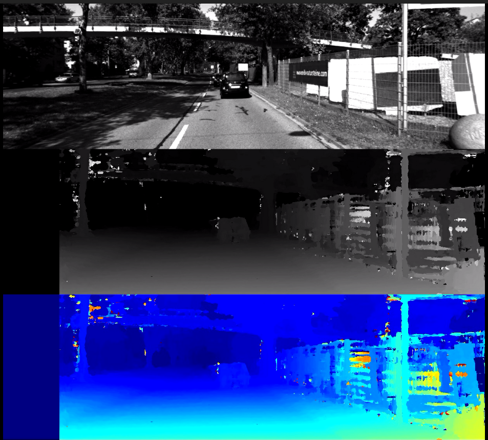
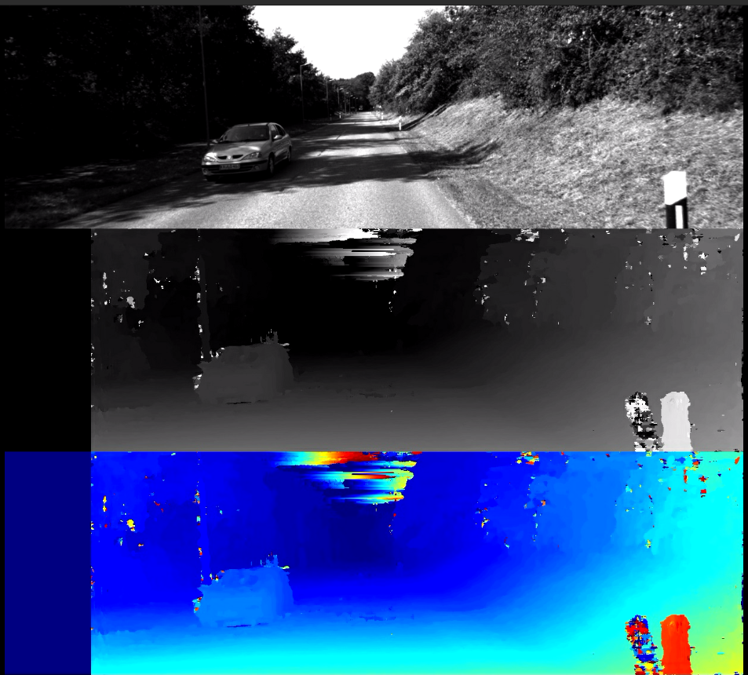

# Depth Estimation

This project is a C++ program that uses stereo vision to estimate the distance. The program uses a multi-block matching approach, census transform, and dynamic programming to efficiently determine disparities.

## Usage

The program requires two input images (left and right views).

The output will be a depth map that shows the estimated distance.

## Results

